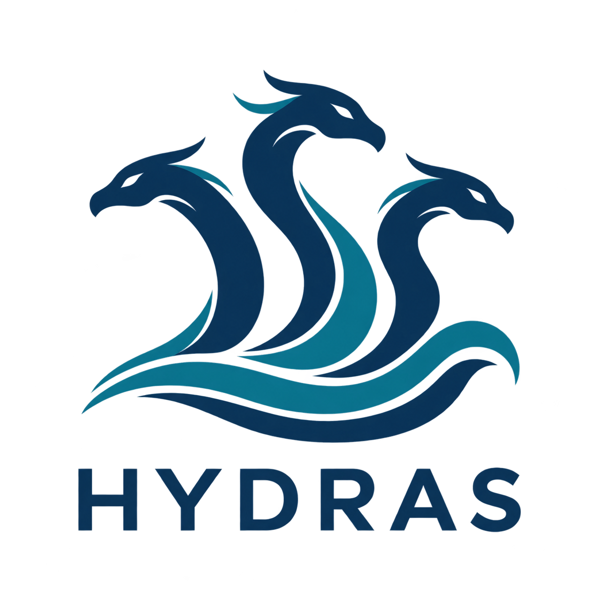

  

## Hydrodynamic-aware Distributed Robots for Marine Source-Seeking

HYDRAS is a research project at the University of Florence combining
autonomous multi-robot sensing, reinforcement learning, and hydrodynamic
modeling for pollutant source localization in coastal and port environments.

## Motivation

Currents, tides, wind-driven mixing, and turbulence shape pollutant
transport in marine environments. The resulting concentration fields
are dynamic and difficult to interpret from sparse, local measurements.

HYDRAS aims to enable scalable and reliable source localization by
connecting cooperative robotic sensing with realistic models of
marine transport.

## Research objectives

The project aims to develop autonomous source-seeking methods for
networks of sensing robots, combining:

- Distributed multi-agent reinforcement learning for cooperative
  source seeking.
- Decentralized control and event-triggered communication.
- Physics-based hydrodynamic simulations for training and evaluation.
- Oceanographic data from Copernicus Marine and EMODnet.

The approach combines model-informed offline training with model-free
online execution: robots learn from simulated marine environments
and select actions from available measurements without requiring
an explicit environment model during operation.

## OCEANS 2026 contribution

**Hydrodynamic-Aware Reinforcement Learning for Autonomous Marine
Source Seeking**

Nicola Forti, Mattia Manneschi, Irene Simonetti, Giorgio Battistelli  
University of Florence, Italy

This initial study investigates centralized source seeking using
a single reinforcement-learning policy and three sensing configurations:
central-agent-only, single ring, and double ring.

The policy is trained using MIKE 21 simulations of coastal hydrodynamics
and pollutant transport near Cecina, Italy. Ring measurements represent
ideal co-moving sensing locations.

At a maximum speed of 1.2 m/s, ring-based PPO achieves 98.4-98.7%
success, compared with 56.4% for the field-climbing baseline.

## Paper, slides and videos

### OCEANS 2026 paper

**Hydrodynamic-Aware Reinforcement Learning for Autonomous Marine Source Seeking**  
Nicola Forti, Mattia Manneschi, Irene Simonetti, and Giorgio Battistelli

We study centralized source seeking using Maskable PPO in time-varying marine concentration fields generated with MIKE 21. The study compares central-agent-only sensing and ideal co-moving single- and double-ring sensing configurations with a field-climbing method (FCM).

[Read the paper (PDF)](assets/HYDRAS_OCEANS2026_paper.pdf)

### Project slides

[View the slides (PDF)](assets/HYDRAS_slides.pdf)

### Code

The centralized single-agent reinforcement learning implementation used in our OCEANS 2026 paper is available in the repository maintained by Mattia Manneschi:

[HYDRAS code on GitHub](https://github.com/MattiaManneschi/HYDRAS-Project)

### Source-seeking videos

The following simulation examples compare FCM with central-agent-only, single-ring, and double-ring PPO at a maximum speed of 1.2 m/s and an initial plume age of 24 h (β = 1/2). The animations show simulated trajectories and concentration fields, rather than field experiments.

#### Source 128 · Wind-forcing class V2

<video controls playsinline preload="none" poster="assets/video_SRC128_preview.png" style="width:100%;max-width:900px;height:auto;" aria-label="Source 128, wind class V2: comparison of FCM and PPO trajectories">
  <source src="assets/group_SRC128_V2_Q1-2.mp4" type="video/mp4">
  Your browser does not support embedded video. Use the link below to open the MP4.
</video>

FCM fails to reach the source within 1,080 decisions. Central-agent-only PPO succeeds in 272 decisions, and both ring-based policies succeed in 130.

[Open or download video: source 128 (MP4)](assets/group_SRC128_V2_Q1-2.mp4)

#### Source 129 · Wind-forcing class V1

<video controls playsinline preload="none" poster="assets/video_SRC129_preview.png" style="width:100%;max-width:900px;height:auto;" aria-label="Source 129, wind class V1: comparison of FCM and PPO trajectories">
  <source src="assets/group_SRC129_V1_Q1-2.mp4" type="video/mp4">
  Your browser does not support embedded video. Use the link below to open the MP4.
</video>

FCM fails to reach the source within 1,080 decisions. Central-agent-only, single-ring, and double-ring PPO succeed in 175, 179, and 180 decisions, respectively.

[Open or download video: source 129 (MP4)](assets/group_SRC129_V1_Q1-2.mp4)

## Opportunities

We welcome expressions of interest in thesis projects and research
opportunities related to:

- Multi-agent systems and cooperative robotics.
- Distributed control and estimation.
- Reinforcement learning for marine environmental monitoring.

Please contact the project team for current opportunities.

## Project contacts

**Nicola Forti**  
Assistant Professor  
Department of Information Engineering (DINFO)  
University of Florence, Italy  
[nicola.forti@unifi.it](mailto:nicola.forti@unifi.it)

**Irene Simonetti**  
Assistant Professor  
Department of Civil and Environmental Engineering (DICEA)  
University of Florence, Italy  
[irene.simonetti@unifi.it](mailto:irene.simonetti@unifi.it)

## Funding

Supported by the University of Florence through the HYDRAS project
(CUP B13C25004820001).
